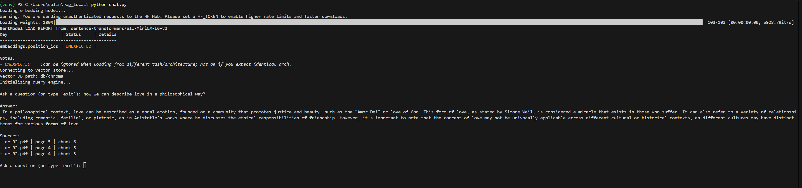

# Local RAG System with Ollama and ChromaDB

## Demo

This project implements a **local Retrieval-Augmented Generation (RAG) pipeline** capable of answering questions over PDF documents.

The system:

- extracts text from PDFs
- splits documents into chunks
- generates embeddings
- stores vectors in a Chroma database
- retrieves relevant context
- generates answers using a local LLM via Ollama

---

# Architecture

PDF Documents
↓
Loader
↓
Chunking
↓
Embeddings
↓
Chroma Vector Database
↓
Retriever
↓
LLM (Ollama)
↓
Answer

---

# Features

- Local RAG pipeline
- Multi-document ingestion
- Vector similarity search
- Source attribution
- Modular architecture
- Runs completely offline

---

# Technologies

- Python
- Ollama
- Mistral
- ChromaDB
- Sentence Transformers
- PyMuPDF

---

# Project Structure

rag_local/
│
├── app/
│ ├── loader.py
│ ├── chunker.py
│ ├── embeddings.py
│ ├── vector_store.py
│ └── query_engine.py
│
├── data/
├── db/
│
├── config.py
├── index.py
├── chat.py
└── requirements.txt

---

# Installation

Clone the repository:

git clone https://github.com/Oalonso11/reg-local-assistant/blob/main/README.md

cd rag_local

Install dependencies:

pip install -r requirements.txt

Install Ollama and start the service:

https://ollama.ai

Download the model:

ollama pull mistral

---

# Usage

## 1. Add your documents

Place your PDF files inside the `data/` folder.

Example:

data/
├── art92.pdf
├── operating_systems.pdf
├── calculus_notes.pdf

---

## 2. Index the documents

Run the indexing pipeline:

python index.py

This will:

- extract text
- split documents into chunks
- generate embeddings
- store vectors in ChromaDB

---

## 3. Start the chat interface

python chat.py

Then ask questions about your documents.

Example:

Ask a question: what is process creation?

Answer:
A process can be created in several ways including system startup,
system calls like fork(), user requests in the terminal,
or batch processing systems.

Sources:

operating_systems.pdf | page 5 | chunk 2

---

# Notes

- The vector database is stored locally in `db/`
- You only need to run `index.py` again when new documents are added
- Everything runs locally (no external APIs required)

---

# Future Improvements

- Support for additional document formats
- Conversation memory
- Streaming responses
- Web interface